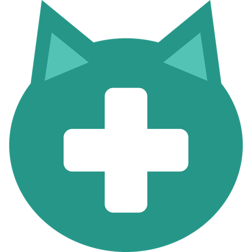

<p align="center">
  
</p>

<h1 align="center">Pet Care for Home Assistant</h1>

<p align="center">
  Medication, measurements and stock for your pets, shared by the whole household.<br>
  <b>No more "did anyone give the cat her inhaler?"</b>
</p>

<p align="center">
  <a href="https://github.com/Krak3N22/ha-pet-care/releases"></a>
  <a href="https://github.com/Krak3N22/ha-pet-care/actions/workflows/tests.yml"></a>
  <a href="https://github.com/Krak3N22/ha-pet-care/actions/workflows/validate.yml"></a>
  <a href="https://hacs.xyz"></a>
  <a href="LICENSE"></a>
</p>

<p align="center">
  <a href="https://my.home-assistant.io/redirect/hacs_repository/?owner=Krak3N22&repository=ha-pet-care&category=integration"></a>
</p>

<p align="center"><a href="https://krak3n22.github.io/ha-pet-care/">Website</a> · <a href="#install">Install</a> · <a href="#setup">Setup</a> · <a href="#actions">Actions</a></p>

---

## Features

- 💊 **Medications:** a *Give dose* button, when it was last given and **by whom**, when it's due next, and an alert when it's overdue.
- 📈 **Measurements:** log values such as weekly blood glucose or weight and get a history graph with reminders.
- 📦 **Stock:** counts down with every dose, shows how many **days are left** and warns when it's running low. **Refill** adds a new pack in one press.
- 👥 **Built for households:** everyone uses their own Home Assistant user, so you always know who did what.
- 🛡️ **Double dose guard:** *"Inhaler was already given at 16:46 by Alex."* Press again within 30 seconds if you really meant it.
- ↩️ **Undo:** mis-tapped? Undo the latest entry and the stock is put back.
- 🕒 **Log afterwards:** forgot to press? Log a dose or measurement at an earlier time.
- 📖 **Readable logbook:** *"Freja got Inhaler from Alex"*, *"Phoenix: Glucose 6.5 mmol/L (measured by Sam)"*.
- 🐶🐱🐰 **Any pet, any medication:** you set up names, units and schedules yourself. Nothing is hard-coded.
- 🌍 English and Swedish.

> [!NOTE]
> Pet Care helps you remember. It is not a medical device. Always follow your vet's advice.

## Install

**With HACS** (recommended): click the *Open in HACS* button above, or add the repository yourself:

1. HACS → ⋮ → **Custom repositories** → add `https://github.com/Krak3N22/ha-pet-care` with the type **Integration**.
2. Download **Pet Care** and restart Home Assistant.

**Manually:** copy `custom_components/pet_care` to `config/custom_components/` and restart.

Requires Home Assistant 2025.3 or newer. The integration icon shows on 2026.3 or newer.

## Setup

1. **Settings → Devices & services → Add integration → Pet Care**, then enter your pet's name.
2. On the pet, choose **Add medication** or **Add measurement**:
   - **Schedule:** times of day (`08:00, 20:00`) *or* every N days. Leave both empty for no schedule.
   - **Medication:** amount per dose, unit (for example puffs or tablets), optional stock, the pack size for the *Refill* button, when to warn about low stock (default 7 days left) and the double dose window (default 2 hours, 0 turns it off).
3. Put the entities on a dashboard. Done.

A dose given up to 2 hours before a scheduled time counts for that time.

### What you get

Each medication or measurement becomes its own device under the pet, for example *Freja Inhaler*:

| Entity | Medication | Measurement |
|---|:-:|:-:|
| **Give dose** (button) | ✅ | |
| **Log value** (number box) | | ✅ |
| Value with history (sensor) | | ✅ |
| **Last given / Last measured** (timestamp) | ✅ | ✅ |
| **… by** (who did it) | ✅ | ✅ |
| **Next due** (timestamp) | if scheduled | if scheduled |
| **Overdue** (problem sensor) | if scheduled | if scheduled |
| **Stock** (number) | if tracked | |
| **Days left** (duration) | if tracked and scheduled | |
| **Low stock** (problem sensor) | if tracked | |
| **Refill** (button) | if a pack size is set | |
| **Undo latest** (button, under Configuration) | ✅ | ✅ |

## Actions

| Action | Target | Fields |
|---|---|---|
| `pet_care.give_dose` | a *Give dose* button | `given_at` (optional), `force` (skip the double dose guard) |
| `pet_care.log_measurement` | a *Log value* number | `value`, `measured_at` (optional) |
| `pet_care.undo` | any entity of the item | |
| `pet_care.refill` | any entity of a medication | `amount` (optional, default one pack) |

<details>
<summary><b>Example:</b> a dashboard button to log a dose afterwards</summary>

Create this script and add it to a dashboard. Home Assistant asks for the time when you run it.

```yaml
alias: Inhaler given earlier
fields:
  given_at:
    name: Given at
    required: true
    selector:
      datetime:
sequence:
  - action: pet_care.give_dose
    target:
      entity_id: button.freja_inhaler_give_dose
    data:
      given_at: "{{ given_at }}"
```

</details>

<details>
<summary><b>Example:</b> a reminder to buy more when stock is low</summary>

```yaml
alias: Inhaler running low
triggers:
  - trigger: state
    entity_id: binary_sensor.freja_inhaler_low_stock
    to: "on"
actions:
  - action: notify.notify
    data:
      message: >
        Freja's inhaler lasts {{ states('sensor.freja_inhaler_days_left') | int }} more days. Time to buy a new one.
```

</details>

<details>
<summary><b>Example:</b> a notification when a dose is overdue</summary>

```yaml
alias: Inhaler overdue
triggers:
  - trigger: state
    entity_id: binary_sensor.freja_inhaler_overdue
    to: "on"
    for: "00:15:00"
actions:
  - action: notify.notify
    data:
      message: "Freja's inhaler is overdue."
```

</details>

## Events

For automations: `pet_care_dose_given`, `pet_care_measurement_logged`, `pet_care_undone` and `pet_care_refilled`.

## Development

```sh
pip install -r requirements_test.txt
pytest
```

Tests run against a real Home Assistant, together with hassfest and HACS validation, on GitHub Actions for every pull request. `main` is protected: changes go through pull requests with passing checks.

Bugs and ideas are welcome in [issues](https://github.com/Krak3N22/ha-pet-care/issues). Report security issues privately, see [SECURITY.md](SECURITY.md).

## License

[MIT](LICENSE)
